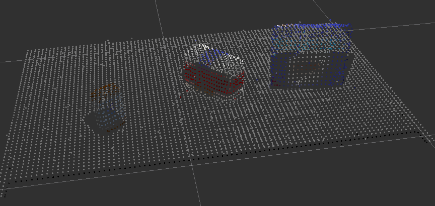

## Project: Perception Pick & Place
[//]: # (Image References)
[orig_pcl]: ./images/orig_pcl.png

---


# Required Steps for a Passing Submission:
1. Extract features and train an SVM model on new objects (see `pick_list_*.yaml` in `/pr2_robot/config/` for the list of models you'll be trying to identify). 
2. Write a ROS node and subscribe to `/pr2/world/points` topic. This topic contains noisy point cloud data that you must work with.
3. Use filtering and RANSAC plane fitting to isolate the objects of interest from the rest of the scene.
4. Apply Euclidean clustering to create separate clusters for individual items.
5. Perform object recognition on these objects and assign them labels (markers in RViz).
6. Calculate the centroid (average in x, y and z) of the set of points belonging to that each object.
7. Create ROS messages containing the details of each object (name, pick_pose, etc.) and write these messages out to `.yaml` files, one for each of the 3 scenarios (`test1-3.world` in `/pr2_robot/worlds/`).  [See the example `output.yaml` for details on what the output should look like.](https://github.com/udacity/RoboND-Perception-Project/blob/master/pr2_robot/config/output.yaml)  
8. Submit a link to your GitHub repo for the project or the Python code for your perception pipeline and your output `.yaml` files (3 `.yaml` files, one for each test world).  You must have correctly identified 100% of objects from `pick_list_1.yaml` for `test1.world`, 80% of items from `pick_list_2.yaml` for `test2.world` and 75% of items from `pick_list_3.yaml` in `test3.world`.
9. Congratulations!  Your Done!

## Exercise 1, 2 and 3 pipeline implemented

All these exercises are finally implemented in the ```project_template.py``` file in the ```pcl_callback()``` function with proper comments. 

The raw point cloud detected by the RGBD camera is shown below. 
![orig_pcl]

As we can see that the point cloud has a lot of error so as to remove that we run a statistical outlier algorithm with a mean k of 20 neighboring points and 0.25 scale factor. The result is shown below:


### Exercise 1: Filtering and RANSAC plane fitting

Next we sample these down into smaller voxels to reduce the amount of computation required using a grid size of 0.01. Next a passthrough filter in both height: 0.6 to 1.1 and width: -0.45 to 0.45 of the table. The result is below



To seperate out the table and objects we use a RANSAC plane fitting algorithm. The outliers of these algorithm are the object point cloud shown below:


### Exercise 2: Clustering for segmentation

We use a Euclidean Clustering technique described here to separate the objects into distinct clusters, thus completing the segmentation process. Results shown below:


### Exercise 3: Object recognition using SVM 
For this exercise first we capture features( histogram of hsv and normals ) by spawning each object in our list in 50 random orientations. Then we train an SVM classifier using an rbf kernel and following is the normalized confusion matrix.


The accuracy score is 0.924


## Results

We store the output of the segmentation in the output folder as ```.yaml``` files for each scene. We are able to correctly classify(100%) on all the test scenes. The following are the screenshots from each of the test scenes.

**Test Scene: 1**:


**Test Scene: 2**:


**Test Scene: 3**:


